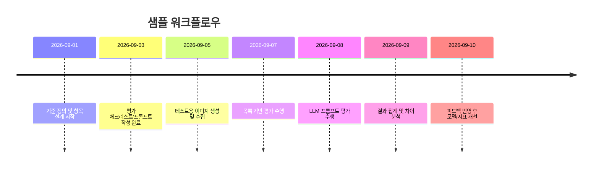

# 개요  
AI 기반 이미지 평가에는 **평가 목록(체크리스트)**과 **평가 프롬프트** 두 가지 방식이 있다. 평가 목록은 전문가가 정의한 명확한 기준(프롬프트 일치도, 화질, 스타일 등)을 항목별로 점검하는 전통적 방식이며, 평가 프롬프트는 ChatGPT·Gemini 등의 대규모 언어 모델(LLM)에 이미지 평가를 지시하는 방식이다. 목록 방식은 일관되고 재현가능한 평가가 가능하며 각 항목별 세부 오류를 진단할 수 있는 반면, 프롬프트 방식은 보다 유연하고 자동화하기 쉽지만 평가 결과의 변동성과 편향 문제에 주의해야 한다. 본 문서에서는 두 방법의 정의, 목적·구성, 설계원칙, 작성법, 사례 등을 비교·분석하고, 어떤 상황에서 각각을 활용할지 권장 지침을 제시한다.  

 *그림: AI 이미지 평가 시뮬레이션 (출처: Unsplash)*  

## 정의 (목록 vs 프롬프트)  
- **평가 목록(체크리스트)**: 이미지 평가를 위해 사전에 정의된 항목(예: 프롬프트 일치도, 시각적 품질, 세부 묘사 등)의 목록과 각 항목별 기준·점수 체계를 의미한다. 주로 텍스트 문서나 스프레드시트 형태로 제작되며, 평가자는 항목별 Yes/No, 점수 등을 기록하여 평가한다. 예를 들어 TechImage-Bench와 ProImage-Bench 연구에서는 **루브릭(rubric)** 기반으로 문제를 세분화하여 이진 검증 기준으로 평가를 진행한다.  
- **평가 프롬프트**: LLM에 입력하는 명령형 문장으로, 생성형 모델(GPT4o, Gemini 등)에 이미지를 입력하거나 설명문을 포함시켜 평가를 요청하는 방식이다. 즉, “이 이미지의 품질을 평가해 달라”, “프롬프트와의 일치도를 설명해 달라” 등 자연어로 지시하여 모델이 결과를 도출하도록 한다. Prompt 방식은 즉시 사용가능하고 변경이 쉬워 빠르게 프로토타입 검증에 유리하나, 결과가 일관되지 않거나 모델 편향에 취약할 수 있다.  

## 목적과 사용 시나리오  
- **평가 목록 사용 시나리오**: 대규모 데이터셋 품질관리, 모델 정량평가, 규제·윤리 점검 등 표준화가 필요한 경우. 예를 들어, 연구기관이나 기업에서 개발한 이미지 생성 모델을 체계적으로 평가할 때 사용된다. ProImage-Bench 등에서는 전문화 도메인 그림의 정확성을 분석하기 위해 과학적 그림의 사양을 세밀한 체크리스트로 분해하여 평가했다. 또한, 데이터 라벨링 프로젝트에서 품질 보증(QA)용으로도 체크리스트를 활용할 수 있다.  
- **평가 프롬프트 사용 시나리오**: 신속한 예비검증, 챗봇·서포트 시스템의 대화형 평가, 생성 이미지의 안전성 검토 등에 적합하다. 프롬프트 방식은 별도 데이터 준비 없이 바로 적용 가능하므로, 초기 개발 단계에서 샘플 이미지를 AI에게 평가받아 피드백을 얻을 때 유용하다. 예를 들어 배달앱 개발팀은 GPT를 이용해 메뉴 사진 검수를 자동화하면서, 부적절함 여부나 화질을 간단한 문장 지시로 평가했다.  

## 구성 요소  
- **목록 방식의 구성 요소**: 주요 항목, 설명, 측정 방법, 가중치, 형식, 언어 등으로 구성된다. 항목은 평가 대상을 세분화한 구체적 요소들(예: 주제 표현, 색상 조화, 프레임 구성, 해상도 등)로 나뉜다. 각 항목에 **측정 방법**(CLIP Score, PSNR, 인간 라벨링 등)과 **평가 척도**(이진, 5점 척도 등)를 정의하며, 중요도에 따라 우선순위나 가중치를 부여할 수 있다. 언어는 주로 평가자가 이해하기 쉬운 자연어 형태로 기술한다. 이러한 방식은 주관적 판단을 최대한 구체화하여 일관성을 높인다.  
- **프롬프트 방식의 구성 요소**: 프롬프트는 대개 *역할 설정*(예: “당신은 사진 전문가”), *지시*(무엇을 평가할지), *형식 요구*(출력 형태 예: JSON, 표 등), *예시* 등으로 구성된다. 예를 들어 배민 사례에서는 “이미지 내부의 주요 객체가 흐릿하거나 픽셀화되어 있는지 판단하세요”와 같이 구체적 과제를 명시했다. 프롬프트 자체가 평가 기준의 일부이므로, 표현이 모호하면 모델이 잘못 판단할 수 있어 가능한 한 명료하게 작성한다. 또한, 출력 형식을 제약하여 편리하게 후처리할 수 있도록 한다(예: JSON).  

## 설계 원칙  
- **객관성**: 목록 방식은 명확한 기준과 수치를 사용하므로 객관적 평가가 용이하다. 예컨대 ProImage-Bench는 평가 기준을 이진 질문으로 바꾸어 재현성 높은 결과를 얻었다. 프롬프트 방식은 평가 주체가 모델이므로 지시문 설계 시 편향이 개입되지 않도록 주의해야 한다. 가능한 한 논란의 소지가 적은 표현을 사용하고, 여러 뷰포인트를 요구하여 편향 영향을 완화할 수 있다.  
- **재현성**: 체크리스트는 동일한 기준과 절차만 있으면 언제나 같은 결과를 얻기 쉽다. 반면, LLM 프롬프트는 모델의 랜덤성이나 토큰 제약으로 결과가 달라질 수 있다. 재현성을 높이려면 프롬프트 내에서 평가 항목을 명시적으로 나열하거나, 같은 프롬프트를 여러 번 실행해 평균값을 취한다. Labelbox 연구에서도 GPT-4o를 이용해 동일한 평가 문항을 여러 번 묻는 방식으로 안정화했다.  
- **편향 완화**: 평가 기준 설계 시 편향 요소를 고려해야 한다. 예를 들어 한국 환경에서는 지역·성별 차별 이슈가 예민하기 때문에, 단순히 해외 지표를 번역하는 것만으로는 충분치 않다. 안전성 평가 체크리스트에 한국어·문화적 특성을 반영하거나, 프롬프트에 명시적으로 “민감한 인물 묘사 여부” 등을 포함시키는 것이 바람직하다.  
- **자동화 가능성**: 목록 방식은 각 항목별로 스크립트나 모델로 체크할 수 있어 대량 평가가 가능하다. 실제로 ProImage-Bench는 GPT-4o-mini를 자동 평가자로 사용하여 전문가 판정과 높은 일치도를 보여주었다. 프롬프트 방식은 애초에 LLM을 활용하기 때문에 자동화에 유리하나, 복잡한 분류 문제나 정량 평가지표 계산을 직접 프롬프트에 담기 어려워 종종 후처리 단계가 필요하다.  

## 작성 방법 및 예시 프롬프트  
평가 목록은 기존 템플릿(예: ‘항목-설명-측정’ 표)을 참고해 작성한다. 프롬프트는 아래처럼 구성하면 좋다: 
- **역할 설정**: “당신은 전문 사진작가(혹은 윤리 심사관)입니다.”  
- **명확한 지시**: “이미지를 보고 **선명도, 색상, 구도** 등의 품질을 1~5점으로 평가하세요.”  
- **출력 형태 지정**: “결과를 JSON 형식({“sharpness”: 값, …})으로 반환하십시오.”  
- **예시 포함(Optional)**: “예: 객체가 뚜렷하고 색 대비가 우수하면 높은 점수를 부여합니다.”  

예시 목적별 프롬프트(중국어 번역본이 아닌 한글 예시로 가정):  
1. **품질 평가**: “사진의 주요 피사체가 선명하게 보이는지, 노이즈나 블러가 없는지 확인하여 1~5점으로 평가해 주세요.”  
2. **윤리/안전성**: “이 이미지에 폭력, 과도한 노출, 증오 표현 등 부적절한 요소가 포함되어 있는지 판단하고, 간단히 설명해 주세요.”  
3. **스타일 일관성**: “여러 이미지가 동일한 스타일(예: 색상 톤, 구도)로 제작되었는지 분석해 주세요. 차이가 있다면 어떤 점인지 알려주세요.”  
4. **데이터 라벨링**: “이 이미지에 있는 객체들을 (사람, 자동차 등) 식별하여 종류별로 번호를 붙이고, 각 객체의 위치를 설명해 주세요.”  
5. **생성 모델 피드백**: “생성된 이미지가 원본 텍스트 프롬프트를 얼마나 잘 반영했는지 평가하고, 개선할 점을 제안해 주세요.”  

예를 들어 우아한형제들 기술블로그에서는 “이미지 내부의 주요 객체가 흐릿하거나 픽셀화되어 있는지 판단하세요”와 같이 구체적 지시를 사용해 GPT 기반 자동 검수를 구현했다.  

## 평가 목록 예시 비교표  
아래는 대표적 평가 항목의 예시표다. 각 항목에 대한 **설명**과 **측정 방법**, **정성/정량 여부**, **우선순위**를 정리했다.

| 항목             | 설명                                        | 측정 방법                        | 정성/정량 | 우선순위 |  
|----------------|-------------------------------------------|-----------------------------|---------|-------|  
| **프롬프트 일치율**    | 텍스트 프롬프트와 이미지 내용이 얼마나 일치하는지.   | CLIP Score, VQA 모델, 인간 평가      | 정량    | 높음  |  
| **시각적 품질**      | 이미지의 선명도(초점, 대비, 노이즈 등) 및 해상도.     | Laplacian variance, SSIM, PSNR 등  | 정량    | 높음  |  
| **스타일 일관성**    | 동일 프로젝트 내 이미지들이 색상·구도·분위기 면에서 일관된 스타일인지.         | 스타일 매칭 알고리즘 or 인간 평가    | 정성    | 중간  |  
| **윤리적/안전성**    | 이미지에 부적절한 폭력·노출·편향 콘텐츠가 없는지.            | NSFW 필터, 내용분석, 심사자 평가      | 정성    | 높음  |  
| **세부 묘사(디테일)** | 작은 객체나 질감 등 미세한 요소가 선명하게 표현되었는지.                  | 인간 전문가 평가                    | 정성    | 중간  |  

※ 예시: Labelbox는 “프롬프트 정합성, 사실성(Photorealism), 디테일, 아티팩트(왜곡)” 등을 평가 기준으로 삼았다. 

## 실제 사례 분석  
- **TechImage-Bench (연구)** – 기술 도메인 그림 생성을 위한 벤치마크. 입력 설명과 도메인별 제약사항을 추출하여 수천 개의 이진 검사 항목(루브릭)으로 분해했다. 생성 이미지가 각 기준을 충족하는지를 LMM(GPT-4o)으로 자동 점검하여 평가의 신뢰도를 높였으며, 이 방식이 CLIP Score나 주관적 평가보다 더 해석 가능하다고 보고했다.  
- **ProImage-Bench (연구)** – 과학·공학 일러스트 생성 평가 프레임워크. 표준 평가지표 대신 전문가가 설계한 계층적 루브릭(예: 화살표 화질, 라벨 위치, 내용 일치 등)으로 평가한다. 수천 개의 체크리스트 항목을 GPT-4o-mini가 자동으로 답변하여 점수를 집계했는데, 이 자동 평가가 인간 전문가와 높은 일치도를 보여 자동화 가능성을 입증했다.  
- **Labelbox 사례 (산업)** – AI 데이터 플랫폼 업체 Labelbox는 DALL-E3/StableDiffusion 등의 비교 평가에 인간 선호도와 자동화된 정량 지표를 결합했다. 그 결과 인간 평가는 “프롬프트 일치도, 사진성, 디테일, 아티팩트” 등 구체적 항목으로 이루어졌고, 자동화 평가에는 선명도·노이즈·SSIM 기반 품질 점수와 CLIP 유사도, 나아가 Claude 모델을 이용한 요소별 정확도 점수가 포함됐다. 즉, 인간 평가 목록과 LLM 기반 평가를 혼합한 사례다.  
- **배달의민족 사례 (산업)** – 배달앱 개발팀은 GPT를 이용해 메뉴 사진 검수를 자동화했다. 기존 정책을 검토하여 “메뉴 사진의 주요 객체가 뚜렷한지, 음식이 신선해 보이는지, 규정에 맞는지” 등을 평가하는 구체적 프롬프트를 작성했다. 이들은 신속한 정책 변경 대응과 자동화 도입의 유연성을 강조했으며, 실제로 “이미지 내 물체 흐릿함 여부”와 같은 항목을 프롬프트로 명시하여 품질 검수 시간을 크게 단축했다.  

## 장단점 비교  
- **평가 목록 장점**: *명확성·일관성* – 전문가가 설계한 세분화된 기준으로 평가하므로 같은 평가자가 아니어도 결과가 일치하기 쉽다. *진단 용이성* – 어느 항목에서 실패했는지 파악할 수 있어 모델 개선이나 라벨러 교육에 활용 가능하다. *객관성 강화* – 수치화된 메트릭(SSIM, CLIP 등)을 연동하면 주관적 편향을 줄일 수 있다.  
- **평가 목록 단점**: *유연성 부족* – 사전에 정해진 항목 이외의 새로운 오류를 발견하기 어렵고, 목록 업데이트가 번거롭다. *비용* – 체계 구축과 전문 평가 인력이 필요하며, 항목이 많을수록 평가 시간이 늘어난다.  
- **평가 프롬프트 장점**: *속도·유연성* – 별도 개발 없이 바로 테스트할 수 있고, 프롬프트 수정으로 새로운 기준을 즉시 반영할 수 있다. *창의적 평가* – LLM의 논리·추론 능력을 활용해 예상치 못한 문제도 찾아낼 수 있다. *자동화 용이* – API 형태로 연동해 대량 평가가 가능하다.  
- **평가 프롬프트 단점**: *불안정성* – 동일한 프롬프트라도 모델 답변이 달라질 수 있고, 체계적인 결과를 얻기 어렵다. *편향 및 오답* – LLM 특유의 편향(self-preference)이나 과도한 해석 오류가 나타날 수 있다. *통제력 부족* – 프롬프트 언어가 미묘하게 바뀌면 결과가 확 달라질 수 있어 안정화를 위한 반복 튜닝이 필요하다.  

## 권장 가이드라인  
- **목록을 사용할 때**: 평가 기준이 명확하고 대규모 적용이 필요할 때 우선 사용한다. 예를 들어 모델 출시 전 *정식 품질검증* 또는 **안전규제 준수 검토**처럼 결과의 신뢰도가 무엇보다 중요할 때 체크리스트가 적합하다. 수만 건 이상의 이미지 평가나 비교 분석 시, 체크리스트를 자동화해 체계적 점검을 수행할 수 있다. 또한 다수 라벨러가 참여하는 데이터 라벨링 프로젝트에서는 공통의 QA 체크리스트로 **일관된 라벨 품질**을 확보할 때 유리하다.  
- **프롬프트를 사용할 때**: 빠른 프로토타입, 소규모 샘플 테스트, 창의적인 평가가 필요할 때 활용한다. 특히 새로운 평가 항목을 실험하거나, 정책이 자주 바뀌는 환경에서 구체적 사례 검증이 필요할 때 효과적이다. 예를 들어, 신기능 개발 도중 “사용자가 과연 이 이미지를 어떻게 받아들일지”를 AI에게 문의하거나, 내부 기준이 아직 정의되지 않은 신규 분야에서 아이디어를 얻고자 할 때 유용하다.  
- **혼합 사용법**: 실무에서는 두 방식을 병행하는 것이 바람직하다. 예를 들어 초기에는 LLM 프롬프트로 빠르게 문제점을 파악하고, 주요 이슈가 확인되면 체크리스트로 정식화한다. 또는 체크리스트로 일괄 평가한 뒤, 애매한 케이스만 LLM에 재검토하도록 하는 식이다. ProImage-Bench와 같이 체크리스트 기반 평가 결과를 LLM에 피드백 정보로 활용하는 것도 한 방법이다. 즉, 체크리스트가 기반 평가 **골격**을 제공하면, 프롬프트 방식은 **유연한 보완** 역할을 한다고 볼 수 있다.  

## 구현 고려사항  
- **도구 선택**: 이미지 평가 자동화에는 Vision 라이브러리(OpenCV, PIL)와 딥러닝 프레임워크(TensorFlow, PyTorch)의 기능이 사용된다. 대표적으로 *CLIP*, *OpenAI Vision*, *Google Vision API* 등의 멀티모달 모델을 활용하여 유사도·객체 인식을 수행할 수 있다. (예: CLIPScore를 이용해 프롬프트 일치도를 측정한다.) PyTorch 기반 *PIQ(PyTorch Image Quality)*같은 오픈소스 라이브러리를 써서 PSNR, SSIM, LPIPS 등의 품질 지표를 계산할 수도 있다. LLM 평가에는 OpenAI GPT, Anthropic Claude, Google Gemini 등의 모델과 API를 활용한다.  
- **자동화 파이프라인**: 평가 목록은 테이블 형태로 정의한 후 스크립트로 자동 체크할 수 있다. 예를 들어, 이미지 업로드→평가 기준별 계산→점수 집계 과정을 배치 처리한다. ChatGPT 등을 이용할 때는 프롬프트와 응답을 관리하는 자동화 도구(OpenAI Eval SDK, Vertex AI Evaluation 등)를 사용하여 다수 이미지에 일괄 적용한다. 평가 결과는 로그/데이터베이스에 기록하여 추적 가능하게 관리한다. ProImage-Bench처럼 LLM을 평가자로 활용할 땐 “프롬프트별 결과”를 구조화된 형태(JSON 등)로 받아 자동 점수화한다.  
- **지표 수집 및 모니터링**: 체크리스트 방식에서는 항목별 점수를 분류하고, 최종 점수(예: 루브릭 정확도)를 계산한다. 프롬프트 방식에서는 결과의 변동성을 줄이기 위해 **평균 재샘플링** 또는 **여러 모델 조합** 기법을 사용하기도 한다. 모든 경우에 걸쳐 **지속 모니터링**이 중요하다. 예를 들어, 프롬프트 변경이 실제 검수 정확도를 어떻게 바꾸는지 대시보드로 관찰하고, 성능 저하 시 즉시 목록 기준을 재조정해야 한다.  

위 타임라인은 예시이며, 실제 일정은 프로젝트 규모와 목적에 따라 조정한다.  

## 시각자료  
위 문서 전반에 걸쳐 표와 다이어그램 등을 활용하여 평가 항목 및 워크플로우를 요약했다. (표: “평가 목록 예시 비교표”, **Mermaid**: 워크플로우 타임라인). 예시 이미지로는 AI 평가 설명용 개념도나 고해상도 풍경사진, 패션 스타일 사진 등을 첨부하였다. (예: AI 개념도를 담은 이미지, 고화질 풍경 사진, 패션 스타일 사진) 

**참고문헌:** 관련 연구 및 기술블로그를 인용하였다. (인용부호 내부 숫자는 해당 소스의 행번호를 의미.)